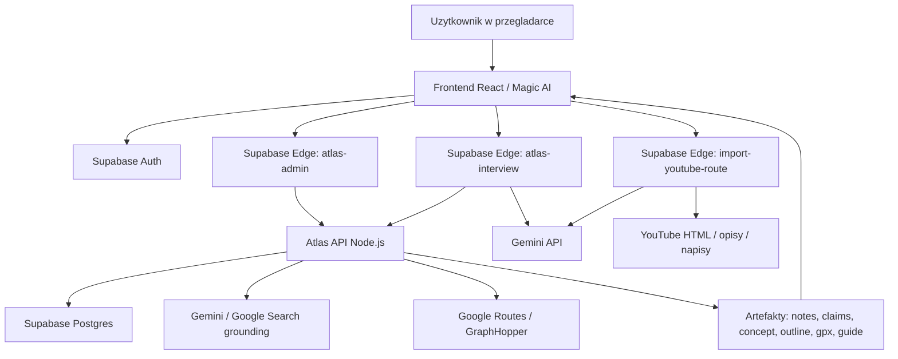
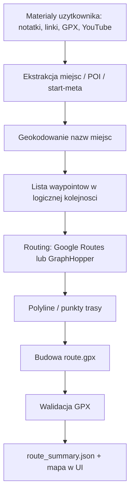

# RouteMarket / Magic AI - stan obecny i mapa systemu

Data analizy: 2026-05-25  
Srodowisko produkcyjne sprawdzone na VPS: `213.165.94.18`  
Repo produkcyjne na VPS: `/root/routemarket-workspace`

## 1. Najkrotszy wniosek

Magic AI nie jest obecnie jednym spojnym agentem. To zestaw kilku osobnych elementow:

- frontend React w zakladce `Magic AI Route Studio`,
- Supabase Edge Functions jako most do AI i Atlas API,
- osobny serwis `Atlas API` w Node.js,
- pipeline `Atlas Workflow`, ktory wykonuje kolejne kroki przez pliki/artifacts i approvale,
- Google/Gemini jako LLM, wyszukiwarka i ekstraktor danych,
- Google Routes / GraphHopper jako potencjalny generator geometrii GPX.

To znaczy, ze system nie dziala jak jeden stabilny asystent, tylko jak polaczony lancuch uslug. Jesli jeden element nie zapisze stanu, nie zwroci oczekiwanego pliku albo zatrzyma sie na approvalu, caly flow wyglada dla uzytkownika jak petla albo martwy koniec.

## 2. Co dziala teraz na VPS

Na VPS dzialaja obecnie te elementy RouteMarket / Atlas:

| Element | Gdzie dziala | Rola |
|---|---:|---|
| Frontend RouteMarket | Docker `frontend-frontend-1`, port `8089` | Strona www, panel twórcy, Magic AI UI |
| Atlas API | Docker `deploy-atlas-api-1`, port lokalny `127.0.0.1:8787` | Backend workflow Magic AI / Atlas |
| Supabase self-hosted | wiele kontenerow `supabase-*` | Auth, baza Postgres, storage, edge functions |
| Supabase Edge Functions | `supabase-edge-functions` | `atlas-admin`, `atlas-interview`, `import-youtube-route` itd. |
| Postgres/Supabase DB | `supabase-db` | Dane aplikacji i artefakty Atlas |

W praktyce produkcyjny przeplyw Magic AI jest teraz na VPS, nie na Cloud Run.

Cloud Run ma pliki konfiguracyjne w repo:

- `apps/atlas-engine/infra/cloud-run/service.yaml`
- `apps/atlas-engine/infra/cloud-run/cloudbuild.yaml`
- `docs/deployment/cloud-run.md`

Ale aktualnie glowny dzialajacy runtime, ktory obsluguje Magic AI, to kontenery na VPS.

## 3. Glowna architektura obecna



## 4. Frontend Magic AI

Najwazniejszy plik:

`apps/frontend/src/pages/CreatorAiStudio.tsx`

Frontend robi kilka rzeczy:

- pokazuje liste projektow Atlas,
- tworzy nowy projekt przez `atlas-admin -> create_project`,
- pozwala dodac materialy: notatki, pliki, GPX, linki,
- uruchamia wywiad AI przez `atlas-interview`,
- zapisuje odpowiedzi z wywiadu do `input/notes/interview_answers.md`,
- uruchamia pipeline Atlas przez `runPipeline`,
- wyswietla kolejne kroki: materialy, wywiad, konspekt, GPX, opis, media, publikacja.

Problem UX/projektowy: frontend zaklada, ze backend i pliki artefaktow beda przechodzic przez bardzo okreslone etapy. Jesli wywiad nie dojdzie do `proposal`, albo pipeline zatrzyma sie na approvalu, UI nie ma prostego, zrozumialego trybu naprawy.

## 5. Gdzie sa "agenci"

W obecnej wersji nie ma jednego centralnego agenta z pamiecia, narzedziami i plannerem. Sa funkcje o charakterze agentowym:

### 5.1. `atlas-interview`

Plik:

`supabase/functions/atlas-interview/index.ts`

Rola:

- prowadzi wywiad z uzytkownikiem,
- czyta czesc notatek z projektu,
- zadaje pytania doprecyzowujace,
- po zebraniu odpowiedzi powinien przejsc do propozycji trasy.

Jak dziala:

- Najpierw ma logike deterministyczna, ktora zadaje pytania o brakujace fakty.
- Potem korzysta z Gemini.
- Ma limit okolo 4 pytan.
- Odpowiedzi wracaja do frontendu jako JSON.

Slaby punkt:

- Stan wywiadu jest trzymany glownie po stronie frontendu jako lista odpowiedzi.
- Wywiad i pipeline Atlas sa osobnymi bytami.
- Jesli UI, odpowiedzi albo walidacja sie rozjada, system moze wracac do poczatku albo powtarzac pytania.

### 5.2. `atlas-admin`

Plik:

`supabase/functions/atlas-admin/index.ts`

Rola:

- bezpieczny most miedzy frontendem a Atlas API,
- sprawdza sesje Supabase,
- sprawdza role `admin` / `creator`,
- przekazuje akcje do Atlas API.

Przykladowe akcje:

- `list_projects`
- `create_project`
- `get_project`
- `get_file`
- `add_notes`
- `add_gpx`
- `add_link`
- `start_run_mvp2_job`
- `approve_stage`
- `put_file`

### 5.3. Atlas Workflow

Plik:

`packages/atlas-workflow/src/workflow-service.ts`

To jest faktyczny silnik pipeline'u. Wykonuje kroki:

1. `input` - buduje research pack z materialow.
2. `claims` - generuje twierdzenia/fakty do weryfikacji.
3. `concept` - generuje koncepcje trasy.
4. `guide_outline` - generuje konspekt przewodnika.
5. `gpx` - generuje albo analizuje GPX.
6. `pois` - wyciaga punkty POI.
7. `guide` - generuje finalny przewodnik.
8. `poi_review` - wymaga zatwierdzenia POI.
9. `finalize` - przygotowuje finalne artefakty i payload do publikacji.

Slaby punkt:

Pipeline zatrzymuje sie na wielu bramkach:

- `claims_approval`
- `concept_approval`
- `guide_outline_approval`
- `gpx_summary_approval`
- `guide_final_approval`
- `poi_approval`

To jest dobre dla jakosci, ale zle dla prostego UX. Dla uzytkownika wyglada to jak "agent nie idzie dalej", jesli frontend nie pokazuje wyraznie, co czeka na akceptacje i dlaczego.

## 6. Jak teraz system szuka informacji

Kod:

- `packages/atlas-research/src/providers/provider-factory.ts`
- `packages/atlas-research/src/providers/google-grounded-search-provider.ts`
- `packages/atlas-research/src/providers/gemini-deep-research-provider.ts`

System ma tryby providerow:

| Tryb | Co robi |
|---|---|
| `mock` | Dane testowe/lokalne, bez prawdziwego wyszukiwania |
| `google` | Gemini Grounding z Google Search |
| `auto` | Jesli jest `GEMINI_API_KEY` lub `GOOGLE_API_KEY`, uzywa Google/Gemini; inaczej mock |

Wyszukiwanie przez Google nie jest klasycznym crawlerem ani pelnym research agentem. To Gemini z narzedziem Google Search grounding, ktore ma zwrocic liste zrodel:

- oficjalne strony turystyczne,
- mapy,
- GPX / Komoot / Wikiloc / AllTrails,
- YouTube,
- fora,
- blogi,
- Reddit.

Deep Research:

- pobiera tekst ze zrodla,
- prosi Gemini o wyciagniecie faktow: POI, ryzyka, logistyka, sezon, dystans, trudnosc,
- nie powinien wymyslac koordynatow, jesli nie ma ich w zrodle.

Slaby punkt:

To nie jest jeszcze stabilny, wielozrodlowy research engine. Brakuje:

- kolejki zadan researchu,
- retry i deduplikacji,
- indeksu wiedzy,
- oceny zrodel na poziomie "czy da sie z tego zbudowac trase",
- osobnego geocodingu i mapowania nazw miejsc na wspolrzedne,
- jasnego rozroznienia miedzy inspiracja a twardym faktem.

## 7. Jak powinien powstawac GPX

Kod:

- `packages/atlas-research/src/gpx/generate-route-gpx.ts`
- `packages/atlas-gis/src/gpx-builder.ts`
- `packages/atlas-gis/src/routing/google-routes-provider.ts`
- `packages/atlas-gis/src/routing/graphhopper-provider.ts`

Docelowy przeplyw GPX:



Obecna logika:

1. Jesli projekt ma juz poprawny `route.gpx`, system go uzywa.
2. Jesli nie, szuka punktow:
   - w `poi_candidates`,
   - w `poi.geojson`,
   - w `route_concept.md`,
   - w `guide_outline.md`,
   - w `notes.md`,
   - w `input/notes/interview_answers.md`.
3. Jesli ma za malo punktow, prosi Gemini o wyciagniecie/propozycje waypointow.
4. Jesli nadal brakuje punktow, probuje fallback regionalny.
5. Do wyznaczenia trasy uzywa:
   - Google Routes dla drog,
   - GraphHopper dla hiking, jesli jest `GRAPHHOPPER_API_KEY`,
   - fallback do Google Routes, jesli GraphHopper zawiedzie.
6. Buduje `route.gpx`.
7. Waliduje GPX.
8. Zapisuje:
   - `route.gpx`,
   - `output/route.gpx`,
   - `route_summary.json`,
   - POI artifacts.

Warunki, zeby GPX powstal dobrze:

- musi byc `GOOGLE_MAPS_API_KEY` albo `GOOGLE_API_KEY`,
- musza byc minimum 2 sensowne punkty trasy,
- punkty musza dac sie zgeokodowac,
- Google Routes / GraphHopper musi zwrocic trase,
- GPX musi przejsc walidacje.

Slaby punkt:

Jesli materialy sa ogolne typu "Tatry", agent moze zaproponowac trase, ale to juz nie jest fakt ze zrodla. Tu potrzebny jest wyrazny tryb:

- "trasa odtworzona z materialow",
- "trasa zaproponowana przez AI",
- "trasa wymaga potwierdzenia przez czlowieka".

## 8. Jak mapa powinna dzialac

Frontend ma komponenty mapowe i 3D:

- `RouteDetailMap`
- `RouteTerrain3D`
- `RouteGlobe3D`
- `RouteExplorerGlobe`

W Magic AI mapa w kroku GPX powinna:

1. dostac `route.gpx`,
2. sparsowac trackpointy,
3. pokazac przebieg trasy,
4. pokazac POI z `poi.geojson`,
5. pokazac podsumowanie z `route_summary.json`.

W praktyce mapa nie ma czego pokazac, jesli:

- nie powstal `route.gpx`,
- `route.gpx` jest pusty lub bledny,
- frontend jest na etapie, ktory jeszcze nie zaladowal artefaktu,
- pipeline stoi na approvalu,
- GPX istnieje tylko w innym path niz frontend czyta.

## 9. Jak dziala import YouTube

Plik:

`supabase/functions/import-youtube-route/index.ts`

Przeplyw:

1. Frontend wysyla link YouTube.
2. Edge Function pobiera HTML filmu.
3. Probuje wyciagnac:
   - tytul,
   - opis,
   - napisy/transkrypcje, jesli sa dostepne.
4. Wysyla tekst do Gemini.
5. Gemini ma zwrocic JSON:
   - tytul,
   - opis,
   - region,
   - dystans,
   - POI,
   - `gpx_points`.
6. Frontend zapisuje opis do notatek, POI do `poi.geojson`, GPX do `route.gpx`.

Slaby punkt:

YouTube czesto blokuje lub zmienia HTML/transkrypcje. Jesli nie ma napisow albo opis nie zawiera konkretow, funkcja nie powinna tworzyc GPX. Obecnie to jest raczej "import inspiracji", a nie pewne odtworzenie trasy.

## 10. Co jest na Cloud Run, a co nie

### Obecnie

Na podstawie repo i dzialajacych kontenerow: produkcyjnie Magic AI jest obslugiwane na VPS.

Cloud Run ma przygotowane pliki deploymentu, ale nie wyglada na to, zeby byl obecnie glownym miejscem pracy Atlas Engine dla routemarket.io.

### Co Cloud Run mialby robic

Cloud Run najlepiej pasuje do:

- hostowania Atlas API jako osobnego, skalowalnego serwisu,
- uruchamiania dlugich jobow AI/research,
- izolowania kosztownych zadan od frontendu i Supabase edge,
- automatycznego skalowania,
- lepszej obserwowalnosci przez Cloud Logging,
- bezpieczniejszego trzymania sekretow w Secret Managerze,
- latwiejszego deploymentu wersji i rollbackow.

### Korzysci Cloud Run

- Stabilniejsze wykonywanie dlugich zadan niz w Edge Functions.
- Mniej problemow z timeoutami funkcji edge.
- Latwiejsza kontrola CPU/RAM dla AI/research/routingu.
- Mozna rozdzielic `API`, `worker`, `scheduler`.
- Lepsza droga do kolejek: Pub/Sub / Cloud Tasks.
- Latwiejsze poziome skalowanie, gdy wielu uzytkownikow generuje trasy.

### Ale Cloud Run nie naprawi sam architektury

Przeniesienie na Cloud Run nie rozwiaze problemu, jesli nadal:

- wywiad jest osobno od pipeline'u,
- stan jest rozrzucony po plikach i approvalach,
- UI nie pokazuje jednoznacznie "czekam na X",
- nie ma jednego modelu zadania,
- GPX zalezy od przypadkowych punktow z tekstu,
- agent nie ma twardego planera narzedzi.

Cloud Run poprawia infrastrukture, ale nie naprawia koncepcji produktu.

## 11. Jak sa przechowywane dane projektow Atlas

Atlas ma abstrakcje repozytorium:

- `FileProjectRepository`
- `PostgresProjectRepository`

Na VPS Atlas API korzysta z Supabase/Postgres, a czesc artefaktow moze byc mirrorowana do filesystemu/volumenow.

W Postgres sa m.in.:

- `atlas_projects` - projekt jako JSON,
- `atlas_artifacts` - artefakty projektu, np. `sources`, `claims`, `workflow_state`, `route_summary`, `input_manifest`,
- eventy projektu,
- approvale,
- missing inputs.

Najwazniejsze pliki/artefakty logiczne:

- `project.json`
- `notes.md`
- `input_manifest.json`
- `input/notes/interview_answers.md`
- `sources.json`
- `claims.json`
- `route_concept.md`
- `guide_outline.md`
- `route.gpx`
- `output/route.gpx`
- `route_summary.json`
- `poi.geojson`
- `guide.md`
- `missing_inputs.json`
- `approvals.json`
- `workflow_state.json`
- `routemarket_payload.json`

## 12. Dlaczego obecny flow sie psuje

Najwieksze problemy projektowe:

1. Wywiad AI i pipeline Atlas to dwa rozne systemy.
2. Frontend ma kilka krokow, ale backend ma wiecej stanow niz UI potrafi jasno pokazac.
3. Pipeline zatrzymuje sie na approvalach, ale uzytkownik nie zawsze widzi, co ma zatwierdzic.
4. Brak jednego obiektu `job`, ktory mowi: status, aktualny krok, blad, czego brakuje, co dalej.
5. Brak mocnego rozdzielenia: "dane pewne" vs "propozycja AI".
6. GPX wymaga konkretow, a wywiad czesto zbiera ogolne odpowiedzi.
7. Materialy z YouTube/blogow czesto nie zawieraja wspolrzednych, a system nadal probuje z nich budowac trase.
8. Edge Functions nie sa idealnym miejscem na dlugie, stateful agentowe procesy.
9. Cloud Run jest przygotowany konfiguracyjnie, ale nie jest docelowo uporzadkowany jako centralny agent/worker.
10. System ma za duzo "ukrytej logiki" w plikach i fallbackach, przez co debugowanie jest trudne.

## 13. Jak ja bym to zbudowal od nowa

Nie zaczynalbym od przepisywania UI. Najpierw zaprojektowalbym jeden stabilny model procesu.

### 13.1. Jeden centralny Route Builder Agent

Jeden backendowy orkiestrator, np. `RouteBuilderJob`, z jasnym stanem:

- `draft`
- `collecting_requirements`
- `researching`
- `extracting_places`
- `planning_route`
- `generating_gpx`
- `validating`
- `generating_guide`
- `waiting_for_user`
- `ready`
- `failed`

Kazdy job ma:

- `id`,
- `project_id`,
- `current_step`,
- `progress`,
- `human_message`,
- `machine_state`,
- `missing_inputs`,
- `artifacts`,
- `cost_estimate`,
- `tool_calls`,
- `errors`.

### 13.2. Wywiad jako czesc joba, nie osobna funkcja

Wywiad powinien byc narzedziem orkiestratora:

- agent sprawdza, czego brakuje,
- generuje maksymalnie 1 ekran pytan,
- pytania sa formularzem/ankieta,
- odpowiedzi zapisuja sie do jednego `requirements.json`,
- agent nigdy nie wraca do poczatku, tylko aktualizuje braki.

### 13.3. Artefakty jako kontrakty

Kazdy etap powinien tworzyc kontrakt:

- `requirements.json`
- `research_sources.json`
- `facts.json`
- `places.json`
- `route_plan.json`
- `gpx_generation_report.json`
- `route.gpx`
- `route_summary.json`
- `guide_outline.md`
- `guide.md`

Jesli nie powstaje `route.gpx`, system musi miec czytelny powod:

```json
{
  "status": "blocked",
  "reason": "missing_start_point",
  "message": "Brakuje dokladnego punktu startu. Podaj parking, adres albo wspolrzedne."
}
```

### 13.4. Narzedzia jako jawny zestaw

Agent powinien miec narzedzia:

- `search_web(query)`
- `fetch_url(url)`
- `extract_places(text)`
- `geocode_place(name, region)`
- `route_between_points(points, profile)`
- `validate_gpx(gpx)`
- `render_map(gpx, pois)`
- `ask_user(form)`
- `write_artifact(name, content)`

Nie powinien udawac, ze "wie". Ma uzywac narzedzi i zapisywac dowody.

### 13.5. Cloud Run jako worker, VPS jako prosty hosting

Rozsadny podzial:

- VPS albo Cloud Run: frontend.
- Supabase managed albo self-hosted: baza, auth, storage.
- Cloud Run `route-builder-api`: API do projektow i jobow.
- Cloud Run `route-builder-worker`: wykonywanie AI/research/GPX.
- Cloud Tasks / PubSub: kolejka jobow.
- Secret Manager: klucze Gemini, Google Maps, GraphHopper.

## 14. Rekomendacja decyzyjna

Moja szczera ocena: obecny Magic AI warto potraktowac jako prototyp i material do nauki, nie jako fundament produkcyjny.

Najlepsza droga:

1. Zostawic obecna strone RouteMarket i konta/uzytkownikow.
2. Nie rozwijac dalej obecnego wieloetapowego Magic AI w tej formie.
3. Zaprojektowac nowy `Route Builder v2` jako jeden proces/job.
4. Najpierw zrobic wersje minimalna:
   - uzytkownik podaje region, typ trasy, dystans/czas, start,
   - agent generuje `route_plan.json`,
   - agent generuje GPX,
   - UI pokazuje mape i raport,
   - dopiero potem przewodnik.
5. Dopiero po stabilnym GPX dodac research, YouTube, blogi, deep research i publikacje.

Najwazniejsza zasada: najpierw stabilny GPX i mapa, potem ladny opis. Bez tego Magic AI bedzie sprawial wrazenie, ze "gada", ale nie dowozi najwazniejszego produktu.

