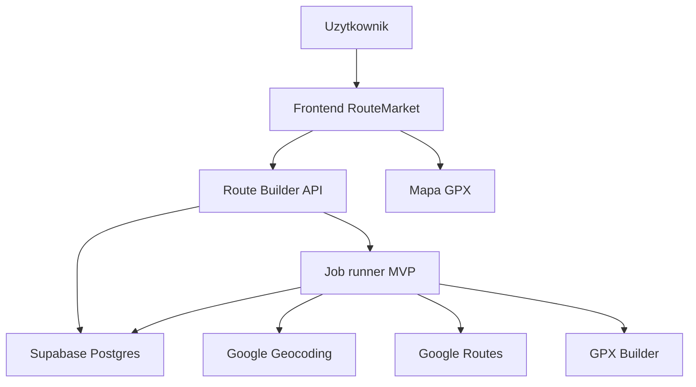

# RouteMarket Route Builder v2 - prompt pack do budowy MVP

Data: 2026-05-25  
Cel: gotowy zestaw promptow i zalozen do budowy MVP nowego silnika Route Builder v2.

Ten plik ma sluzyc jako instrukcja startowa dla kolejnych sesji z AI/Codexem albo dla developera. Kazdy prompt jest zaprojektowany tak, zeby budowac maly, sprawdzalny fragment systemu.

## 1. Cel MVP

MVP Route Builder v2 ma dowozic jedna podstawowa wartosc:

> Uzytkownik podaje podstawowe wymagania trasy, system tworzy trase, generuje GPX, pokazuje mape i krotki raport.

Na tym etapie NIE budujemy jeszcze pelnego Magic AI z YouTube, dlugim researchem i pelnym przewodnikiem. Najpierw stabilny GPX i mapa.

## 2. Zakres MVP

MVP zawiera:

- tworzenie projektu trasy,
- formularz wymagan,
- jeden backendowy job,
- status/progress joba,
- geokodowanie punktow,
- generowanie trasy przez Google Routes,
- budowe pliku GPX,
- walidacje GPX,
- zapis artefaktow,
- pokazanie mapy i podsumowania w UI.

MVP nie zawiera:

- importu YouTube,
- deep research,
- pelnego przewodnika premium,
- marketplace publishing,
- wielu agentow,
- zlozonych approvali,
- pelnej automatycznej propozycji trasy bez danych.

## 3. Minimalna architektura MVP



Na MVP mozna zaczac prosciej niz finalny Cloud Run:

- API i worker moga byc jednym serwisem Cloud Run,
- job moze byc prostym procesem async w backendzie,
- kolejke Cloud Tasks mozna dodac w kolejnym etapie,
- najwazniejsze jest jedno zrodlo prawdy o jobie w bazie.

## 4. Minimalny przeplyw uzytkownika

1. Uzytkownik klika "Nowa trasa AI".
2. Wypelnia formularz:
   - typ trasy,
   - region,
   - punkt startu,
   - punkt koncowy albo petla,
   - dystans/czas,
   - poziom trudnosci,
   - preferencje nawierzchni,
   - czego unikac.
3. System tworzy projekt i job.
4. UI pokazuje progress.
5. Backend geokoduje punkty.
6. Backend generuje trase.
7. Backend zapisuje `route.gpx`, `route_summary.json`, `gpx_generation_report.json`.
8. UI pokazuje mape.
9. Uzytkownik zatwierdza albo poprawia wymagania.

## 5. Kontrakty danych

### 5.1. `requirements.json`

```json
{
  "route_type": "motorcycle|cycling|gravel|hiking|city_walk",
  "region": "Tatry, Polska",
  "start_point": "Parking Kuźnice, Zakopane",
  "end_point": null,
  "loop": true,
  "distance_target_km": 20,
  "duration_target_h": null,
  "difficulty": "easy|moderate|hard|expert",
  "surface_preferences": ["asphalt", "gravel", "trail"],
  "avoid": ["highways", "exposure", "private_roads"],
  "ai_can_suggest_missing_points": true,
  "language": "pl"
}
```

### 5.2. `route_builder_job`

```json
{
  "id": "job_123",
  "project_id": "route_456",
  "status": "queued|running|waiting_for_user|ready|failed",
  "current_step": "geocoding_places",
  "progress": 35,
  "human_message": "Geokoduje punkt startowy.",
  "missing_inputs": [],
  "error_code": null,
  "error_message": null
}
```

### 5.3. `gpx_generation_report.json`

```json
{
  "status": "generated|blocked|failed",
  "provider": "google_routes",
  "waypoints": [
    {
      "name": "Parking Kuźnice",
      "lat": 49.2701,
      "lng": 19.9802,
      "source": "user_input",
      "confidence": 0.95
    }
  ],
  "distance_km": 20.4,
  "track_point_count": 542,
  "warnings": []
}
```

### 5.4. Blokada zamiast udawania sukcesu

```json
{
  "status": "blocked",
  "reason": "missing_end_or_loop_permission",
  "message": "Do GPX potrzebuje punktu koncowego albo zgody na zaproponowanie petli.",
  "actions": [
    "Podaj punkt koncowy",
    "Pozwol AI zaproponowac petle",
    "Wgraj GPX"
  ]
}
```

## 6. Zasady techniczne dla AI/Codex

Kazdy prompt w tym pliku powinien byc wykonywany wedlug zasad:

- najpierw sprawdz repo i aktualna strukture,
- nie niszcz obecnego RouteMarket,
- buduj v2 jako osobny modul,
- nie mieszaj v2 z obecnym Magic AI bez potrzeby,
- po kazdym etapie uruchom test lub smoke test,
- zapisuj decyzje w dokumentacji,
- zadbaj o prosty rollback,
- GPX i mapa maja pierwszenstwo przed tekstem.

## 7. Prompt 0 - orientacja w repo

```text
Pracujemy nad RouteMarket Route Builder v2. Nie naprawiaj starego Magic AI, tylko przeanalizuj repo i przygotuj miejsce pod nowy modul v2.

Cele:
1. Znajdz aktualna strukture frontendu, Atlas API, Supabase functions i dokumentacji.
2. Wskaz, gdzie najlepiej umiescic nowy backend Route Builder v2.
3. Sprawdz, jakie komponenty mozna odzyskac: GPX builder, Google Routes provider, mapa, walidacja GPX.
4. Nie edytuj jeszcze kodu, chyba ze potrzebujesz stworzyc pusty folder/docs.
5. Zakoncz krotkim raportem: proponowana struktura katalogow i pierwsze pliki do utworzenia.

Kontekst:
- Obecny Magic AI jest prototypem i ma problemy ze stanem.
- MVP v2 ma najpierw generowac GPX i mape.
- Cloud Run jest docelowym miejscem backendu/workerow.
```

## 8. Prompt 1 - utworzenie szkieletu backendu v2

```text
Zbuduj szkielet Route Builder v2 jako osobny modul backendowy.

Wymagania:
1. Nie ruszaj starego Magic AI.
2. Utworz nowy backend API, najlepiej w strukturze monorepo, np. `apps/route-builder-api` albo zgodnie z konwencja repo.
3. Dodaj endpointy:
   - `GET /health`
   - `POST /route-projects`
   - `GET /route-projects/:id`
   - `POST /route-projects/:id/jobs`
   - `GET /route-projects/:id/jobs/:jobId`
4. Dodaj typy danych:
   - RouteProject
   - RouteRequirements
   - RouteBuilderJob
   - RouteArtifact
5. Dodaj prosta walidacje Zod.
6. Dodaj test/smoke test endpointu health.
7. Przygotuj README z lokalnym uruchomieniem.

Na tym etapie job moze tylko przejsc przez fake progress i zapisac status `ready`.
```

## 9. Prompt 2 - baza danych i repozytorium

```text
Dodaj warstwe danych dla Route Builder v2.

Wymagania:
1. Zaprojektuj minimalne tabele SQL:
   - `route_builder_projects`
   - `route_builder_jobs`
   - `route_builder_artifacts`
   - `route_builder_events`
2. Dodaj migracje SQL w repo.
3. Dodaj repository/service do zapisu i odczytu projektow oraz jobow.
4. Endpoint `POST /route-projects` ma zapisywac projekt w DB.
5. Endpoint `POST /route-projects/:id/jobs` ma tworzyc job w DB.
6. Endpoint `GET /route-projects/:id/jobs/:jobId` ma zwracac aktualny stan joba.
7. Nie zapisuj sekretow w repo.
8. Dodaj testy repository lub smoke script.

Zasada:
Jedno zrodlo prawdy o stanie joba to baza, nie localStorage i nie rozrzucone pliki.
```

## 10. Prompt 3 - requirements i walidacja brakow

```text
Dodaj obsluge `requirements.json` i walidacje brakujacych danych dla Route Builder v2.

Wymagania:
1. Zdefiniuj `RouteRequirements`.
2. Dodaj walidator, ktory sprawdza:
   - route_type,
   - region,
   - start_point,
   - end_point albo loop=true,
   - distance_target_km albo duration_target_h,
   - difficulty.
3. Jesli brakuje danych, job ma przejsc w status `waiting_for_user`.
4. Backend ma zwracac `missing_inputs` i gotowy formularz doprecyzowania.
5. Nie wolno udawac sukcesu, jesli brakuje danych do GPX.

Przyklad:
Jesli nie ma punktu koncowego i loop=false, zwroc:
`missing_end_or_loop_permission`.
```

## 11. Prompt 4 - geokodowanie punktow

```text
Dodaj etap geokodowania dla Route Builder v2.

Wymagania:
1. Dodaj provider Google Geocoding albo Places.
2. Wejscie: `start_point`, `end_point`, opcjonalne waypoints.
3. Wyjscie: `places.json` / `geocoding_report.json`.
4. Kazdy punkt ma miec:
   - name,
   - lat,
   - lng,
   - confidence,
   - source,
   - provider.
5. Jesli punkt jest niejednoznaczny, job ma przejsc w `waiting_for_user` z opcjami wyboru.
6. Dodaj mock provider do testow bez Google API.
7. Dodaj test dla mock providera.

Nie generuj jeszcze GPX. Tylko geokodowanie i zapis raportu.
```

## 12. Prompt 5 - Google Routes i GPX

```text
Dodaj generowanie GPX dla Route Builder v2.

Wymagania:
1. Uzyj lub wydziel istniejacy Google Routes provider i GPX builder.
2. Wejscie: zgeokodowane punkty z `places.json`.
3. Jesli punktow jest mniej niz 2, zwroc `blocked`.
4. Wywolaj Google Routes.
5. Zbuduj `route.gpx`.
6. Zweryfikuj GPX.
7. Zapisz artefakty:
   - `route.gpx`
   - `gpx_generation_report.json`
   - `route_summary.json`
8. Job ma pokazac progress:
   - geocoding,
   - routing,
   - building_gpx,
   - validating_gpx,
   - ready.
9. Dodaj test z mock route providerem.

Priorytet: stabilnosc i jasne bledy, nie ladne teksty.
```

## 13. Prompt 6 - frontend MVP

```text
Dodaj minimalny frontend Route Builder v2 w RouteMarket.

Wymagania:
1. Nie usuwaj starego Magic AI.
2. Dodaj nowa strone np. `/route-builder-v2`.
3. Formularz:
   - typ trasy,
   - region,
   - start,
   - koniec/petla,
   - dystans/czas,
   - trudnosc,
   - preferencje.
4. Po submit tworz projekt i job.
5. Pokaz progress joba przez polling.
6. Jesli status `waiting_for_user`, pokaz ankiete/formularz brakow.
7. Jesli status `ready`, pokaz link/podglad GPX i mape.
8. UI ma byc prosty, czytelny, bez przeprojektowywania calej strony.
9. Dodaj smoke test lub instrukcje testu manualnego.
```

## 14. Prompt 7 - mapa GPX

```text
Podlacz podglad mapy do Route Builder v2.

Wymagania:
1. Uzyj istniejacego komponentu mapy, jesli da sie go odzyskac.
2. Wczytaj `route.gpx`.
3. Sparsuj trackpointy.
4. Pokaz linie trasy.
5. Pokaz start/meta.
6. Pokaz `route_summary.json`: dystans, czas, provider, liczba punktow.
7. Jesli GPX nie istnieje, pokaz powod z `gpx_generation_report.json`.
8. Nie pokazuj pustej mapy bez komunikatu.
```

## 15. Prompt 8 - Cloud Run deployment MVP

```text
Przygotuj deployment Route Builder v2 na Google Cloud Run.

Wymagania:
1. Dodaj Dockerfile dla route-builder-api.
2. Dodaj `cloudbuild.yaml`.
3. Dodaj `service.yaml`.
4. Dodaj liste wymaganych env vars:
   - SUPABASE_URL
   - SUPABASE_SERVICE_ROLE_KEY
   - GOOGLE_MAPS_API_KEY
   - GEMINI_API_KEY opcjonalnie
   - ROUTE_BUILDER_API_TOKEN albo auth przez Supabase JWT
5. Dodaj healthcheck.
6. Dodaj dokument deployu krok po kroku.
7. Nie zapisuj sekretow w repo.
8. Upewnij sie, ze lokalnie nadal da sie testowac mock providerem.
```

## 16. Prompt 9 - kolejka jobow

```text
Dodaj kolejke zadan do Route Builder v2.

Wymagania:
1. Zaprojektuj integracje z Cloud Tasks lub Pub/Sub.
2. `POST /route-projects/:id/jobs` ma tworzyc job i wrzucac zadanie do kolejki.
3. Worker ma pobrac job i wykonac pipeline.
4. Dodaj retry z limitem.
5. Dodaj blokade przed uruchomieniem wielu aktywnych jobow dla tego samego projektu.
6. Dodaj logi tool calls.
7. Dodaj statusy:
   - queued,
   - running,
   - waiting_for_user,
   - ready,
   - failed.
```

## 17. Prompt 10 - krotki raport trasy

```text
Dodaj generowanie krotkiego raportu trasy po GPX.

Wymagania:
1. Raport ma powstac po `route_summary.json`.
2. Ma zawierac:
   - podsumowanie,
   - dystans,
   - czas,
   - typ trasy,
   - punkty start/meta,
   - ostrzezenia,
   - ograniczenia danych.
3. Jesli jest Gemini API, mozna wygenerowac ladny tekst.
4. Jesli nie ma Gemini API, wygeneruj deterministyczny template.
5. Raport zapisuj jako `route_report.md`.
6. Raport nie moze udawac, ze research byl wykonany, jesli go nie bylo.
```

## 18. Prompt 11 - test end-to-end MVP

```text
Przeprowadz test end-to-end Route Builder v2.

Scenariusz:
1. Utworz projekt: hiking, Tatry, start "Parking Kuźnice Zakopane", petla=true, dystans 12 km, trudnosc moderate.
2. Uruchom job.
3. Sprawdz statusy po kolei.
4. Sprawdz, czy powstaly:
   - requirements.json
   - places.json
   - gpx_generation_report.json
   - route.gpx
   - route_summary.json
5. Sprawdz, czy mapa potrafi pokazac trase.
6. Jesli cos nie dziala, napraw.
7. Zakoncz raportem: co dziala, co nie, jakie sa ryzyka.
```

## 19. Prompt 12 - decyzja o podmianie starego Magic AI

```text
Porownaj obecne Magic AI z Route Builder v2 MVP i przygotuj plan podmiany.

Wymagania:
1. Sprawdz, co dziala w v2.
2. Sprawdz, czego nadal brakuje wzgledem starego Magic AI.
3. Zaproponuj sposob wlaczenia v2:
   - jako osobna zakladka,
   - jako beta,
   - jako zamiennik starego Magic AI.
4. Nie usuwaj starego flow bez backupu.
5. Przygotuj checklist rollbacku.
```

## 20. Kolejnosc uzycia promptow

Rekomendowana kolejnosc:

1. Prompt 0 - orientacja w repo.
2. Prompt 1 - szkielet backendu.
3. Prompt 2 - baza danych.
4. Prompt 3 - requirements.
5. Prompt 4 - geokodowanie.
6. Prompt 5 - GPX.
7. Prompt 6 - frontend.
8. Prompt 7 - mapa.
9. Prompt 11 - test E2E.
10. Prompt 8 - Cloud Run.
11. Prompt 9 - kolejka.
12. Prompt 10 - raport.
13. Prompt 12 - podmiana starego Magic AI.

## 21. Definicja sukcesu MVP

MVP jest udane, jesli:

- uzytkownik moze utworzyc projekt,
- system nie zapetla wywiadu,
- job ma jasny status,
- przy brakach system pokazuje konkretne pytanie/formularz,
- GPX powstaje albo system uczciwie mowi, dlaczego nie,
- mapa pokazuje trase,
- route summary zgadza sie z GPX,
- backend ma logi i artefakty,
- mozna odtworzyc blad z joba.

## 22. Najwieksze ryzyka

- Google Routes nie zawsze dobrze wspiera hiking/offroad.
- Google Maps API moze generowac koszty.
- Geokodowanie nazw potrafi byc niejednoznaczne.
- AI moze proponowac punkty bez wystarczajacych dowodow.
- Za wczesne dodanie YouTube/researchu ponownie skomplikuje MVP.
- Brak kolejki moze byc OK na MVP, ale nie na produkcje.

## 23. Zasada produktowa

Jesli trzeba wybierac:

1. Najpierw GPX.
2. Potem mapa.
3. Potem raport.
4. Potem research.
5. Potem przewodnik.
6. Na koncu YouTube i "magia".

Bez stabilnego GPX Magic AI bedzie tylko ladnym chatbotem, a nie narzedziem do tras.

