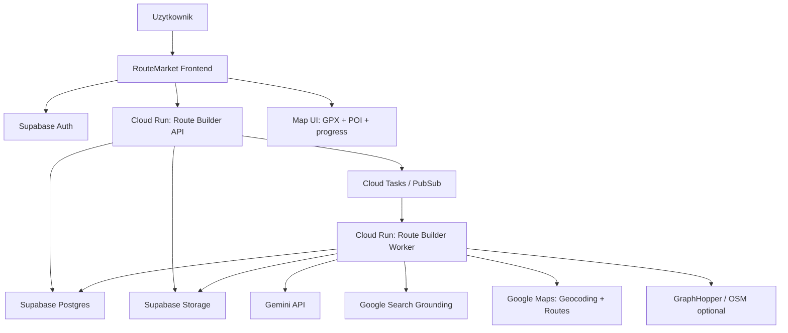

# RouteMarket Route Builder v2 - plan architektury i budowy

Data: 2026-05-25  
Cel: zbudowac od nowa stabilny silnik Magic AI / Route Builder, ktory faktycznie dowozi trase, GPX, mape i przewodnik.

## 1. Decyzja architektoniczna

Cloud Run ma sens, ale nie jako przeniesienie obecnego Magic AI 1:1. Obecny system jest za bardzo posklejany z osobnych Edge Functions, approvali, plikow i frontendu. Cloud Run powinien byc fundamentem nowego silnika v2.

Najwazniejsza zasada v2:

> Najpierw stabilny proces tworzenia trasy i GPX, dopiero potem rozbudowany opis, media, YouTube i marketplace.

Route Builder v2 powinien dzialac jak jeden proces/job, a nie jak kilka osobnych agentow.

## 2. Docelowy obraz systemu



## 3. Podzial odpowiedzialnosci

### Frontend RouteMarket

Frontend ma byc cienki i czytelny. Nie powinien sam prowadzic logiki agentowej.

Odpowiada za:

- formularz startowy trasy,
- upload materialow,
- pokazanie ankiety doprecyzowania,
- pokazanie postepu joba,
- pokazanie mapy, GPX, POI i raportu,
- akceptacje lub poprawki uzytkownika,
- publikacje gotowej trasy.

Nie odpowiada za:

- planowanie trasy,
- research,
- wyciaganie punktow,
- generowanie GPX,
- zarzadzanie stanem pipeline'u.

### Route Builder API - Cloud Run

To publiczny backend dla frontendu.

Odpowiada za:

- tworzenie projektow,
- tworzenie jobow,
- odczyt statusu,
- zapis odpowiedzi uzytkownika,
- zarzadzanie artefaktami,
- autoryzacje uzytkownika,
- wysylanie zadan do kolejki,
- udostepnianie wynikow frontendowi.

Przykladowe endpointy:

```txt
POST /route-projects
GET  /route-projects/:id
POST /route-projects/:id/materials
POST /route-projects/:id/jobs
GET  /route-projects/:id/jobs/:jobId
POST /route-projects/:id/answers
POST /route-projects/:id/approve
GET  /route-projects/:id/artifacts
GET  /route-projects/:id/map
```

### Route Builder Worker - Cloud Run

To serce systemu. Worker wykonuje dlugie zadania.

Odpowiada za:

- analiza wymagan,
- generowanie pytan doprecyzowujacych,
- research,
- ekstrakcje faktow,
- geokodowanie miejsc,
- planowanie przebiegu trasy,
- generowanie GPX,
- walidacje GPX,
- generowanie map preview,
- generowanie przewodnika.

### Supabase

Supabase zostaje jako:

- Auth,
- Postgres,
- Storage,
- Realtime/polling statusu,
- dane uzytkownikow,
- dane marketplace.

Mozna zostac przy self-hosted na VPS, ale docelowo dla stabilnosci lepszy bylby managed Supabase. Jesli zostajemy self-hosted, trzeba bardzo pilnowac backupow.

### Cloud Tasks / PubSub

Kolejka jest konieczna, bo generowanie trasy to nie request HTTP 5 sekund, tylko proces.

Kolejka daje:

- retry,
- status zadan,
- brak gubienia pracy,
- kontrolowanie kosztow,
- limit rownoleglych jobow,
- odporność na timeouty.

## 4. Jeden model joba

Kazde tworzenie trasy to jeden `RouteBuilderJob`.

```json
{
  "id": "job_123",
  "project_id": "route_456",
  "status": "running",
  "current_step": "generating_gpx",
  "progress": 62,
  "human_message": "Wyznaczam trase po drogach na podstawie 5 punktow.",
  "missing_inputs": [],
  "cost_estimate": {
    "tokens": 12000,
    "maps_calls": 8
  },
  "started_at": "2026-05-25T12:00:00Z",
  "updated_at": "2026-05-25T12:03:00Z"
}
```

Statusy:

```txt
draft
queued
running
waiting_for_user
waiting_for_approval
ready
failed
cancelled
```

Kroki:

```txt
collecting_requirements
analyzing_materials
asking_clarification
researching
extracting_facts
extracting_places
geocoding_places
planning_route
generating_gpx
validating_gpx
rendering_map
generating_outline
generating_guide
quality_check
ready_for_publish
```

## 5. Artefakty jako kontrakty

Obecny system ma duzo plikow, ale nie ma wystarczajaco jasnych kontraktow. W v2 kazdy etap musi produkowac konkretny artefakt.

| Artefakt | Rola |
|---|---|
| `requirements.json` | co uzytkownik chce zbudowac |
| `materials_manifest.json` | lista zalaczonych plikow/linkow |
| `research_sources.json` | zrodla znalezione w sieci |
| `facts.json` | fakty z dowodami i zrodlami |
| `places.json` | miejsca/POI/start/meta z confidence |
| `route_plan.json` | logiczny plan trasy |
| `geocoding_report.json` | co udalo sie zmapowac na koordynaty |
| `gpx_generation_report.json` | jak powstal lub czemu nie powstal GPX |
| `route.gpx` | finalny plik GPX |
| `route_summary.json` | dystans, czas, przewyzszenia, trudnosc |
| `map_preview.json` | dane do mapy |
| `guide_outline.md` | konspekt przewodnika |
| `guide.md` | pelny opis trasy |
| `quality_report.json` | ocena gotowosci do publikacji |

Kazdy artefakt musi miec status:

```txt
missing
draft
generated
needs_user_input
needs_review
approved
failed
```

## 6. Wymagania wejściowe

System nie powinien zaczynac od chaotycznego chatu. Powinien zaczynac od struktury.

Minimalny formularz:

- typ trasy: motor, rower, gravel/MTB, piesza, city walk,
- region,
- punkt startu,
- czy petla,
- dystans albo czas,
- poziom trudnosci,
- preferowana nawierzchnia,
- czego unikac,
- czy AI moze proponowac brakujace punkty.

Dopiero potem agent moze zadac ankiete doprecyzowujaca.

## 7. Ankieta doprecyzowania

Zamiast klasycznego chatu:

```json
{
  "type": "clarification_form",
  "title": "Brakuje 3 informacji do wygenerowania GPX",
  "questions": [
    {
      "id": "start_point",
      "label": "Skad ma ruszac trasa?",
      "type": "single_choice_with_custom",
      "options": [
        "Parking Kuźnice",
        "Dworzec Zakopane",
        "Wpisze wlasny punkt"
      ],
      "required": true
    }
  ]
}
```

Wazne:

- agent nie moze pytac o to samo drugi raz,
- odpowiedzi aktualizuja `requirements.json`,
- jesli brakuje danych do GPX, UI pokazuje dokladnie czego brakuje,
- uzytkownik zawsze widzi "co dalej".

## 8. Tryby pracy agenta

### Tryb 1: Odtworz trase z materialow

Uzytkownik daje GPX, film, blog, screeny, notatki.

Agent:

- wyciaga fakty,
- wyciaga miejsca,
- buduje trase tylko z potwierdzonych informacji,
- jesli brakuje danych, pyta.

### Tryb 2: Zaproponuj trase

Uzytkownik mowi: "chce trase w Tatrach okolo 20 km".

Agent:

- moze sam zaproponowac punkty,
- musi oznaczyc je jako `ai_suggested`,
- musi dac raport, ze to propozycja, nie odtworzenie z materialu.

### Tryb 3: Ulepsz moja trase

Uzytkownik ma GPX.

Agent:

- analizuje GPX,
- dodaje POI,
- dodaje opis,
- ocenia trudnosc,
- poprawia przewodnik,
- nie zmienia przebiegu bez zgody.

## 9. Research i zrodla

V2 powinno miec jawny research pipeline:

1. Generowanie zapytan.
2. Google Search grounding.
3. Pobranie stron.
4. Ekstrakcja tekstu.
5. Ekstrakcja faktow.
6. Ocena zrodla.
7. Deduplikacja.
8. Zapis do `facts.json`.

Typy zrodel:

- oficjalne strony turystyczne,
- parki narodowe,
- lokalne urzedy/turystyka,
- Komoot/Wikiloc/AllTrails,
- OpenStreetMap,
- YouTube,
- blogi,
- fora,
- Reddit.

Kazdy fakt powinien miec:

```json
{
  "claim": "Parking w Kuznicach jest popularnym punktem startu szlakow.",
  "type": "logistics",
  "source_url": "https://...",
  "confidence": 0.82,
  "status": "source_grounded"
}
```

## 10. GPX i mapy

GPX jest najwazniejszym produktem. Bez niego Magic AI jest tylko generatorem tekstu.

Proces GPX:

1. Wczytaj wymagania.
2. Zbierz miejsca z materialow i researchu.
3. Geokoduj miejsca przez Google Geocoding / Places.
4. Uloz logiczna kolejnosc punktow.
5. Zapytaj Google Routes / GraphHopper.
6. Zbuduj GPX.
7. Zweryfikuj GPX.
8. Pokaz mape.
9. Popros uzytkownika o akceptacje.

Jesli GPX nie powstaje, system nie moze mowic "gotowe". Musi pokazac:

```json
{
  "status": "blocked",
  "reason": "missing_waypoints",
  "message": "Mam tylko jeden konkretny punkt. Do GPX potrzebuje startu i mety albo zgody na propozycje AI.",
  "actions": [
    "Podaj punkt koncowy",
    "Pozwol AI zaproponowac petle",
    "Wgraj GPX"
  ]
}
```

## 11. Proponowana baza danych

Minimalne tabele:

```txt
route_projects
route_builder_jobs
route_materials
route_artifacts
route_facts
route_places
route_tool_calls
route_job_events
route_approvals
```

### `route_builder_jobs`

Najwazniejsze kolumny:

- `id`
- `project_id`
- `user_id`
- `status`
- `current_step`
- `progress`
- `human_message`
- `error_code`
- `error_message`
- `missing_inputs`
- `cost_estimate`
- `created_at`
- `updated_at`

### `route_artifacts`

- `id`
- `project_id`
- `job_id`
- `type`
- `name`
- `status`
- `storage_path`
- `json_data`
- `text_preview`
- `created_at`

## 12. Bezpieczenstwo i koszty

Cloud Run + Google APIs moga generowac koszty, wiec trzeba od poczatku dodac:

- limity na liczbe jobow na uzytkownika,
- limity Google Maps calls,
- limity Gemini tokens,
- budzet per projekt,
- blokade dlugich researchy bez potwierdzenia,
- cache geocodingu,
- cache researchu,
- retry z limitem.

W UI powinno byc:

- "Szacowany koszt: niski/sredni/wysoki",
- "Ten etap uzyje Google Maps",
- "Ten etap moze potrwac 2-5 minut".

## 13. Plan budowy krok po kroku

### Etap 0 - decyzje i sprzatanie

Cel: nie budowac na chaosie.

Zadania:

- zamrozic obecne Magic AI jako prototyp,
- zostawic obecny RouteMarket frontend i uzytkownikow,
- utworzyc osobny modul `route-builder-v2`,
- ustalic, czy Supabase zostaje self-hosted czy managed,
- przygotowac repo i branch.

Rezultat:

- nowa specyfikacja,
- folder/serwis v2,
- brak mieszania z obecnym Atlas bez potrzeby.

### Etap 1 - Route Builder API

Cel: stworzyc backend z jednym modelem projektu i joba.

Zadania:

- endpoint tworzenia projektu,
- endpoint tworzenia joba,
- endpoint statusu joba,
- tabele DB,
- zapis eventow,
- autoryzacja Supabase JWT,
- prosty healthcheck.

Rezultat:

- frontend moze zalozyc projekt i obserwowac status.

### Etap 2 - Worker i kolejka

Cel: zadania nie moga dzialac w request/response.

Zadania:

- Cloud Tasks/PubSub,
- worker Cloud Run,
- retry,
- limit rownoleglych jobow,
- zapis postepu,
- logi tool calls.

Rezultat:

- job moze trwac kilka minut i nie zginie.

### Etap 3 - Requirements + ankieta

Cel: koniec z petla wywiadu.

Zadania:

- `requirements.json`,
- detektor brakow,
- generator formularza doprecyzowania,
- UI ankiety,
- zapis odpowiedzi,
- mechanizm "nie pytaj o to samo".

Rezultat:

- agent pyta konkretnie i tylko wtedy, gdy musi.

### Etap 4 - Minimalny GPX bez researchu

Cel: najpierw dowiezc mape.

Zakres:

- uzytkownik wpisuje start, meta/petla, dystans, typ trasy,
- geokodowanie,
- Google Routes,
- GPX,
- mapa,
- raport.

Bez:

- YouTube,
- deep research,
- dlugiego przewodnika.

Rezultat:

- pierwsza stabilna wartosc produktu: "dostaje trase i GPX".

### Etap 5 - GPX z uploaded GPX

Cel: jesli uzytkownik ma GPX, system ma go perfekcyjnie obsluzyc.

Zadania:

- upload GPX,
- walidacja,
- route summary,
- mapa,
- POI manualne,
- opis techniczny.

Rezultat:

- system dziala tez jako "ulepszacz istniejacej trasy".

### Etap 6 - Research v1

Cel: research jako wsparcie, nie chaos.

Zadania:

- Google Search grounding,
- pobieranie stron,
- ekstrakcja faktow,
- `facts.json`,
- cytowania/zrodla,
- confidence.

Rezultat:

- agent ma zrodla i fakty, ale jeszcze nie udaje pelnej autonomii.

### Etap 7 - Places / POI

Cel: mapowalne miejsca.

Zadania:

- ekstrakcja miejsc,
- geocoding,
- deduplikacja,
- typy POI,
- confidence,
- UI do zatwierdzania POI.

Rezultat:

- POI na mapie, nie tylko tekst.

### Etap 8 - Guide generator

Cel: przewodnik dopiero po trasie.

Zadania:

- outline,
- guide,
- sekcje logistyczne,
- sekcje bezpieczenstwa,
- wskazowki,
- powiazanie z faktami i POI.

Rezultat:

- przewodnik oparty na GPX i faktach.

### Etap 9 - YouTube / media import

Cel: YouTube jako zrodlo inspiracji, nie magiczne zrodlo prawdy.

Zadania:

- import tytulu/opisu/transkrypcji,
- ekstrakcja miejsc,
- oznaczanie pewnosci,
- prosba o potwierdzenie,
- dopiero potem GPX.

Rezultat:

- import YouTube nie psuje procesu, tylko zasila materialy.

### Etap 10 - Publikacja do marketplace

Cel: gotowy RouteMarket draft.

Zadania:

- payload publikacji,
- walidacja jakosci,
- draft route,
- podglad publiczny,
- status published/draft.

Rezultat:

- trasa moze wejsc do marketplace.

## 14. Minimalny MVP v2

Pierwsza wersja, ktora ma sens:

1. Uzytkownik tworzy projekt.
2. Wpisuje region, typ trasy, start, petla/meta, dystans.
3. System geokoduje punkty.
4. System generuje trase przez Google Routes.
5. System tworzy GPX.
6. UI pokazuje mape.
7. Uzytkownik moze zatwierdzic albo poprawic punkt.
8. System generuje krotki opis techniczny.

To jest mniejsze niz obecne Magic AI, ale duzo bardziej wartosciowe.

## 15. Co zostawic z obecnego systemu

Warto odzyskac:

- czesc frontendowych komponentow UI,
- czesc komponentow mapy,
- kod walidacji GPX,
- kod budowania GPX,
- czesc integracji Google Routes,
- czesc promptow do Gemini,
- doswiadczenie z approvalami.

Nie warto kopiowac 1:1:

- obecnego wywiadu jako osobnej Edge Function,
- wieloetapowego pipeline'u approvali w obecnej postaci,
- rozrzucenia stanu po wielu plikach,
- ukrytych fallbackow,
- flow, ktory najpierw generuje tekst, a potem probuje z niego wyprodukowac GPX.

## 16. Moja rekomendacja wykonawcza

Najrozsadniejsza droga:

1. Zostawic produkcyjny RouteMarket na VPS.
2. Stworzyc `Route Builder v2` jako osobny Cloud Run backend.
3. Zrobic MVP tylko dla GPX + mapa + krotki opis.
4. Dopiero gdy to bedzie stabilne, dolaczyc research i YouTube.
5. Po sprawdzeniu v2 podmienic zakladke Magic AI na nowy flow.

Nie polecam dalej reanimowac obecnego Magic AI, poza drobnymi poprawkami, bo architektonicznie jest za kruche.

