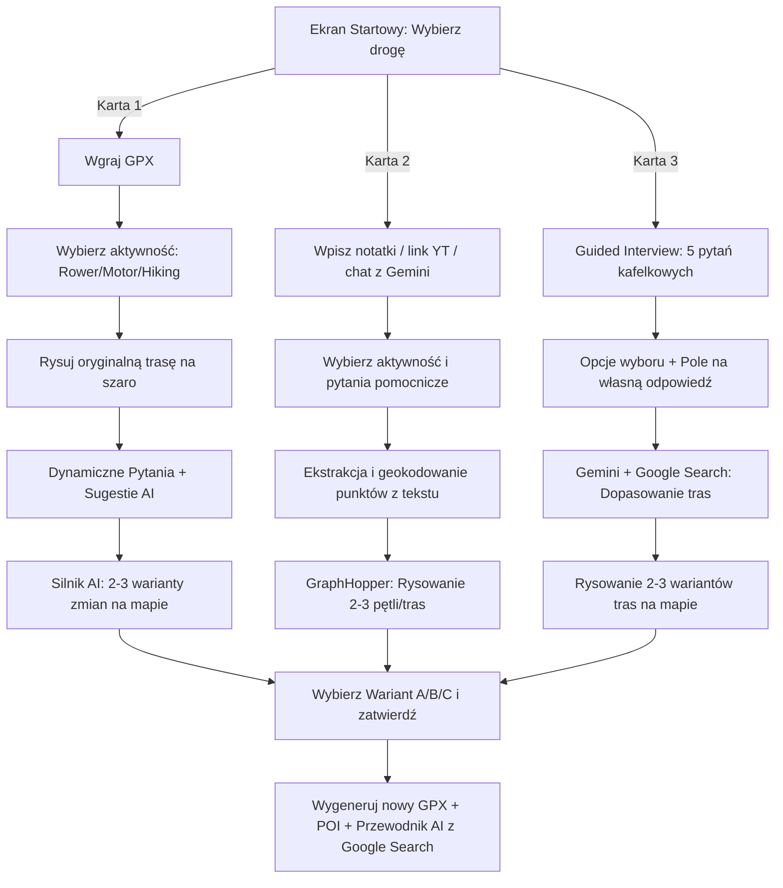

# Plan Architektury i Budowy — RouteMarket Builder v3
**Nowa Koncepcja: 3 Dedykowane Drogi Pracy (Kreator v3)**

- **Data:** 2026-05-27
- **Status:** Gotowy do wdrożenia (oczekuje na decyzję użytkownika)
- **Cel:** Przekształcenie RouteMarket Builder v2 w rewolucyjne, trójścieżkowe narzędzie ułatwiające budowanie tras za pomocą AI, z dynamicznymi pytaniami, wieloma wariantami śladów na mapie jednocześnie (Leaflet neon) oraz automatycznym generowaniem przewodników na bazie Google Search Grounding.

---

## 🎨 1. Wizja i Interfejs Użytkownika (Dashboard Startowy)

Główny ekran `/route-builder-v2` zostanie przeprojektowany na super-nowoczesny, minimalistyczny dashboard w ciemnej kolorystyce (dark mode) z jaskrawymi neonowymi akcentami (Cyan, Emerald, Amber).

Na górze strony widnieć będzie elegancki, podświetlany napis zachęcający do działania:
> **✨ Powiedz, co chcesz dzisiaj zrobić:**

Poniżej znajdą się **3 duże, symetryczne, klikalne kafle (karty)** wykonane w technologii **glassmorphism** (półprzezroczyste tło, delikatna neonowa ramka, mikro-cień na hover, animacja wejścia przez Framer Motion):

```
+---------------------------------------------------------------------------------------------------+
|                                  ✨ Powiedz, co chcesz zrobić                                    |
+---------------------------------------------------------------------------------------------------+
|                                                                                                   |
|  +-----------------------------+   +-----------------------------+   +-------------------------+  |
|  | 📂 DROGA 1                  |   | 📝 DROGA 2                  |   | 🧭 DROGA 3              |  |
|  | Mam pomysł i plik GPX       |   | Mam pomysł, własne          |   | Szukam inspiracji       |  |
|  | który chcę dopracować       |   | materiały, film z YT ect.   |   | i gotowego pomysłu      |  |
|  | i wzbogacić o POI i opis.   |   | Stwórzmy trasę od zera.     |   | Zaplanujmy coś razem!   |  |
|  |                             |   |                             |   |                         |  |
|  | -> Wgraj plik .gpx          |   | -> Wklej notatki / link YT  |   | -> Krótka ankieta       |  |
|  +-----------------------------+   +-----------------------------+   +-------------------------+  |
|                                                                                                   |
+---------------------------------------------------------------------------------------------------+
```

*Mockup wizualny tego dashboardu został wygenerowany jako asset i zapisany w pliku:*  
`route_builder_v3_dashboard_1779863054552.png`

---

## 🏗️ 2. Szczegółowy Przebieg 3 Dróg (User Flows)



### 📂 DROGA 1: Ulepszanie i wzbogacanie własnego GPX

Użytkownik posiada już gotowy ślad trasy nagrany zegarkiem lub telefonem, ale chce stworzyć z niego profesjonalny produkt: dodać ciekawe miejsca (POI), wygenerować pasjonujący przewodnik krajoznawczy i poprawić ewentualne niedoskonałości śladu.

1. **Wgranie pliku:** Strefa drag-and-drop przyjmuje plik `.gpx`.
2. **Wybór Aktywności:** Szybki wybór ikony:
   * 🏍️ **Motocykl**
   * 🚴 **Rower**
   * 🥾 **Hiking (Pieszo)**
3. **Wizualizacja:** System natychmiast parsuje plik i rysuje oryginalny ślad na mapie w neutralnym kolorze szarym (`#6b7280`).
4. **Dynamiczne Pytania o Modyfikacje:**
   * Pojawia się pytanie: **"Co chciałbyś zmienić w tej trasie lub czego szukasz?"**
   * Użytkownik widzi interaktywne "pillsy" (wielokrotnego wyboru) zależne od wybranej aktywności:
     * **Jazda Motocyklem:**
       * `[ Więcej krętych dróg / zakrętów ]`
       * `[ Więcej punktów widokowych ]`
       * `[ Omijanie dróg ekspresowych / krajowych ]`
       * `[ Ciekawa klimatyczna kawiarnia na trasie ]`
     * **Jazda Rowerem:**
       * `[ Więcej dróg szutrowych / leśnych (Gravel) ]`
       * `[ Unikanie ruchliwego asfaltu ]`
       * `[ Płaski profil (omijanie podjazdów) ]`
       * `[ Miejsca odpoczynku / źródła wody ]`
     * **Hiking (Pieszo):**
       * `[ Więcej widokowych grzbietów górskich ]`
       * `[ Ciekawe schroniska / punkty gastronomiczne ]`
       * `[ Dzika ścieżka / mniej uczęszczana trasa ]`
       * `[ Atrakcje historyczne i przyrodnicze ]`
   * Dodatkowo wyświetlane są **dwa pytania pomocnicze** (np. preferowane tempo, czas trwania) oraz **pole na własną odpowiedź**.
5. **Prezentacja 2-3 alternatyw:**
   * Gemini 2.5 projektuje modyfikacje. Silnik routingu generuje alternatywne ślady.
   * Na mapie Leaflet nakładane są jednocześnie **2 lub 3 warianty** w jaskrawych kolorach neonowych:
     * 🟢 **Wariant A (Krajobrazowy/Scenic):** Neon Green (`#10b981`)
     * 🔵 **Wariant B (Przygoda/Techniczny):** Neon Cyan (`#06b6d4`)
     * 🟡 **Wariant C (Szybki/Express):** Neon Amber (`#f59e0b`)
   * Panel boczny pozwala przełączać warianty, pokazując zaktualizowany dystans, profil wysokościowy oraz przewidywany czas.
6. **Zatwierdzenie i Finał:** Po wyborze wariantu użytkownik klika "Zatwierdź". System generuje:
   * **Nowy plik GPX** z wbudowanymi nowo dodanymi punktami zwrotnymi.
   * **Interaktywne POI** z unikalnymi emoji na mapie.
   * **Obszerny Przewodnik AI** oparty o wyszukiwarkę Google (Google Search Grounding) w ładnym formacie Markdown.

---

### 📝 DROGA 2: Tworzenie z notatek, czatu i YouTube

Dla użytkowników, którzy mają luźny pomysł, słyszeli o trasie w filmie na YouTube, przeczytali wpis na blogu turystycznym lub chcą opisać trasę własnymi słowami w interaktywnym czacie z Gemini.

1. **Wprowadzanie Materiałów:**
   * **Duży edytor tekstowy:** "Wklej tutaj notatki, plan wycieczki z Worda, lub listę miejscowości".
   * **Pole na link YouTube / WWW:** Użytkownik wkleja np. link do vloga motocyklowego. Backend w tle uruchamia parser transkrypcji i pobiera całą treść filmu.
   * **Chat z Gemini:** Bezpośrednie okno czatu, w którym można napisać: *"Chcę zrobić pętlę rowerową wokół jeziora Wigry, zacząć w Suwałkach, zobaczyć Klasztor w Kamedułach, a na obiad zjeść kartacze"*.
2. **Wybór Aktywności i Filtrów:** Wybranie profilu (Rower/Motor/Hiking) + dynamiczne filtry (jak w Drodze 1).
3. **Trasowanie:**
   * Gemini analizuje transkrypcję/notatki/chat i wyodrębnia nazwy miejscowości i atrakcji turystycznych.
   * Punkty te są automatycznie geokodowane przy pomocy `geocodingService`.
   * Silnik routingu (GraphHopper) układa z nich **2-3 alternatywne spójne trasy** i rysuje je na mapie w neonowych kolorach.
4. **Zatwierdzenie i Finał:** Użytkownik wybiera najlepszą opcję, pobiera gotowy plik GPX oraz otrzymuje kompletny przewodnik turystyczny AI.

---

### 🧭 DROGA 3: Szukam inspiracji (Guided Interview)

Scenariusz dla kogoś, kto chce gdzieś pojechać, ale kompletnie nie ma pomysłu na trasę. System prowadzi go krok po kroku przez krótki, angażujący wywiad.

1. **Formularz Kafelkowy (5 Pytań):** Każde pytanie zawiera **3-4 predefiniowane duże kafelki z ikonami + dedykowane pole na wpisanie własnej odpowiedzi**:
   * **Pytanie 1: Gdzie chcesz jechać / W jakim regionie?**
     * `[ ⛰️ Tatry i Podhale ]` `[ ⛵ Mazury i Kraina Jezior ]` `[ 🌲 Bieszczady ]` `[ 🏰 Jura Krakowsko-Częstochowska ]`
     * `[ ✍️ Wpisz własny region lub miasto... ]`
   * **Pytanie 2: Co najbardziej chcesz robić?**
     * `[ 🏛️ Zwiedzać zabytki i zamki ]` `[ 🍃 Odpoczywać na łonie natury ]` `[ 🍲 Jeść lokalne specjały ]` `[ 📸 Robić piękne zdjęcia widokowe ]`
     * `[ ✍️ Wpisz własny cel wyjazdu... ]`
   * **Pytanie 3: Gdzie chcesz zaparkować / zacząć?**
     * `[ 🚗 Darmowy duży parking ]` `[ 🚉 Blisko stacji kolejowej / Centrum ]` `[ 🌲 Dowolne ustronne miejsce ]`
     * `[ ✍️ Inna lokalizacja startowa... ]`
   * **Pytanie 4: Jaki dystans / czas trwania Cię interesuje?**
     * `[ 🚶 Krótki spacer (do 5 km / 2h) ]` `[ 🏃 Średni dystans (10-20 km) ]` `[ 🎒 Całodniowa wyprawa (30+ km) ]`
     * `[ ✍️ Wpisz konkretną liczbę kilometrów... ]`
   * **Pytanie 5: Jaki poziom trudności preferujesz?**
     * `[ 🟢 Płaski i rekreacyjny ]` `[ 🟡 Średni z kilkoma podejściami ]` `[ 🔴 Wymagający (dużo przewyższeń) ]`
     * `[ ✍️ Moje własne preferencje... ]`
2. **Generowanie:**
   * Dane profilowe trafiają do Gemini. Z wykorzystaniem Google Search Grounding wyszukiwane są najlepsze lokalne trasy i punkty POI.
   * System wyrysowuje na mapie **2-3 warianty dopasowanych tras**.
3. **Zatwierdzenie i Finał:** Pobranie GPX, wygenerowanie przewodnika i listy przydatnych wskazówek (np. gdzie zostawić auto, opłaty za wstęp do parku).

---

## 🛠️ 3. Plan Implementacji Technicznej (Kod i Architektura)

### KROK 1: Rozszerzenie Kontraktów i Bazy Danych
1. **Typy w Backendzie (`apps/route-builder-api/src/types/index.ts`):**
   * Dodanie typu artefaktu `'alternatives'` przechowującego tablicę wariantów tras w formacie GeoJSON z informacjami o kolorach, dystansie i POI.
2. **Baza Danych (Supabase):**
   * Zapewnienie obsługi zapisywania artefaktu `alternatives` w tabeli `route_artifacts` (pole typu `jsonb`).

### KROK 2: Rozbudowa Backend API
1. **Logika Alternatyw (`routing.ts` / `getRouteAlternatives`):**
   * Stworzenie dedykowanej funkcji, która na podstawie punktu startowego, wybranej aktywności i preferencji użytkownika generuje 3 matematycznie zróżnicowane trasy (np. trasa standardowa, trasa o zwiększonych zakrętach/ciekawych punktach, trasa najszybsza).
   * Dołączanie dedykowanych punktów POI oznaczonych ikonami (np. ☕ dla kawiarni, 📸 dla widoków).
2. **Endpoint Wyboru Wariantu (`POST /route-projects/:id/select-alternative`):**
   * Odbiera wybrany `variantId` od frontendu.
   * Podmienia główne artefakty projektu (`gpx`, `summary`, `places`) na dane z wybranego wariantu.
   * Uruchamia job generowania ostatecznego przewodnika turystycznego przez Gemini dla wybranej modyfikacji.

### KROK 3: Przebudowa Frontendu (React + TS)
1. **Dashboard Startowy (`DashboardStartV3.tsx`):**
   * Utworzenie minimalistycznego ekranu wyboru z 3 dużymi kartami wejściowymi.
   * Zastosowanie efektów hover, cieniowania i płynnych animacji przejścia.
2. **Dynamiczny Kreator Wielokrokowy (`RouteBuilderV3.tsx`):**
   * Wdrożenie maszyny stanów obsługującej aktualną drogę (1, 2 lub 3).
   * Dynamiczny formularz z "pillsami" dopasowany do aktywności.
   * Kafelkowy kreator krok-po-krok (Droga 3) z opcją wpisywania własnych odpowiedzi.
3. **Obsługa Mapy z Wariantami (`RouteDetailMapV3.tsx` / Leaflet):**
   * Przeprojektowanie komponentu mapy, aby potrafił rysować jednocześnie wiele polilinii o różnych barwach neonowych.
   * Zapewnienie, że nieaktywne trasy są półprzezroczyste, a trasa obecnie wybrana w panelu bocznym jest grubsza i jaskrawa.
   * Obsługa klikania w konkretną linię trasy bezpośrednio na mapie w celu jej zaznaczenia.

---

## 🚦 4. Plan Weryfikacji (Testy i Jakość)

1. **Testy Statyczne (TypeScript):**
   * Uruchomienie `tsc` w monorepo w celu zapewnienia, że wszystkie nowe typy wariantów tras i POI są w 100% bezpieczne.
2. **Testy E2E (Playwright):**
   * Stworzenie automatycznego skryptu testującego każdą z 3 ścieżek od wyboru karty na dashboardzie do wygenerowania i pobrania pliku GPX.
3. **Manualna Weryfikacja UX:**
   * Sprawdzenie interfejsu w przeglądarce pod kątem estetyki premium, płynności animacji mapy Leaflet przy przełączaniu wariantów oraz responsywności ankiety na urządzeniach mobilnych.
